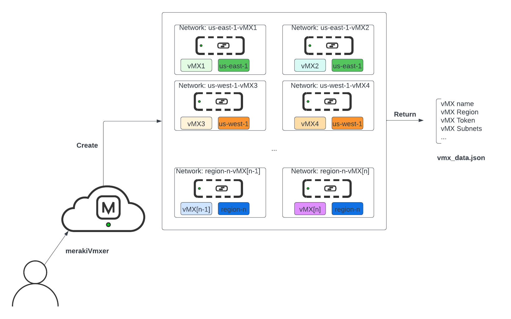
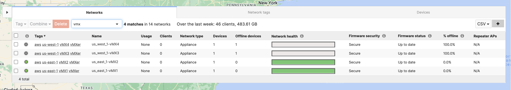
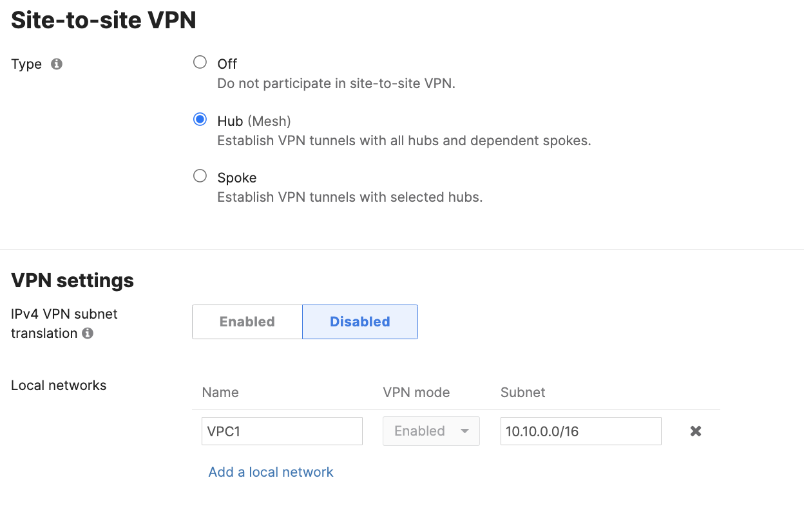
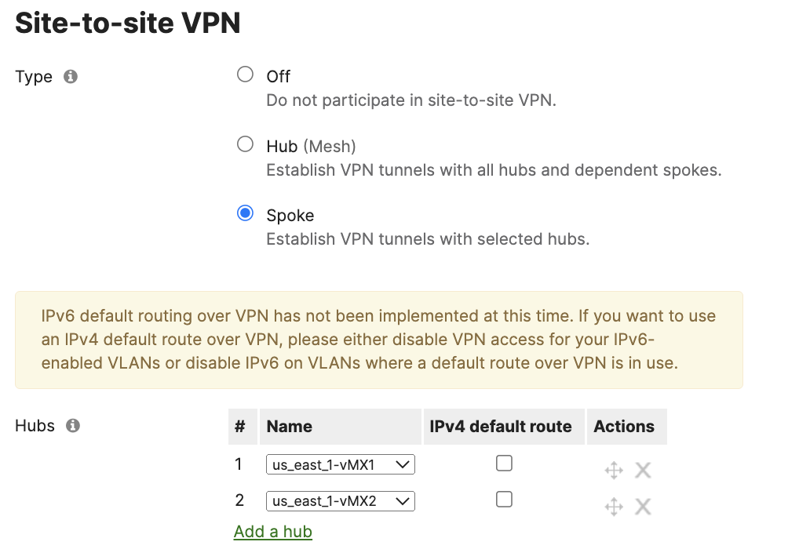

# merakiVmxer
Instantiate and configure multiple vMXs for cloud deployment, and fetch their auth tokens.

# Table of Contents

[Introduction](#intro)

[Prerequisites](#prereq)

[How to use](#howtouse)

# Introduction

This script automates the process of vMX creation within the Meraki dashboard, as well as getting back authentication tokens for ease of deployment into cloud environments like AWS, Azure and GCP. It does not automate the creation of resources within AWS, Azure or GCP, and is intended to be used in tandem with other resources like:

1. [Cisco Meraki Virtual MX on the AWS Cloud](https://aws-quickstart.github.io/quickstart-cisco-meraki-sd-wan-vmx/)
2. [Cisco Meraki Virtual MX with AWS Cloud WAN on the AWS Cloud Quickstart](https://aws-quickstart.github.io/quickstart-cisco-meraki-vmx-cloudwan/)
3. [vMX and Azure vWAN](https://documentation.meraki.com/MX/Deployment_Guides/vMX_and_Azure_vWAN)
4. [vMX as a Router Appliance for Google Network Connectivity Center](https://documentation.meraki.com/MX/Deployment_Guides/vMX_with_Google_Network_Connectivity_Center)

The script will:

1. Create 2 vMX networks for every 2 regions specified in config.py
2. Tag said vMXs with a number of functional tags described later in this document
3. Configure each of these vMXs in passthrough (default) or routed mode
4. Retrieve the authentication token for each of them (has finite expiration)
5. Output to the console and to a json file details about every vMX created for reference in your cloud environment

## Prerequisites

1. Active Cisco Meraki subscriptions in the org where the script will be run
2. API access enabled for these organizations, as well as an API Key with access to them. See how to enable [here](https://documentation.meraki.com/General_Administration/Other_Topics/Cisco_Meraki_Dashboard_API)
3. A working Python 3.0 environment
4. Install libraries in `requirements.txt`
5. Active account in a public cloud provider like AWS, Azure, GCP or Alibaba

## How to Use

1. Clone repo to your working directory with `git clone https://github.com/Francisco-1088/merakiVmxer.git`
2. Edit `config.py`
* Add your API Key under `api_key` in line 3
* Add the Organization ID or the Organization name (not both) in lines 4 or 5 of the organization you want to work on. Leave the other blank ("")
* Specify a `deployment_mode` as `passthrough` or `routed`
* Specify a `client_track` mode as `MAC address` or `IP address`
* Specify a role in the VPN under `vpn_mode` as either `hub` or `spoke`
* Specify the number of regions you will deploy in under `num_regions`
* Specify the region names you will work on within your cloud provider under `regions` separated by commas. The number of values must match the value in `num_regions`. Your vMXs will be assigned the corresponding region tag.
* Specify the vMX size of your images under `vmx_size` as `small`, `medium` or `large`
* Specify the cloud environment you will work on as `aws`, `azure`, `gcp` or `alibaba`. Your vMXs will be assigned this tag
* Specify the naming scheme for your Meraki networks for each pair of vMX networks. This list must have exactly the same number of values as specified by `num_regions`
* Specify the summary ranges of your VPC/VNET networks under `vpc_summary_ranges`
* Optionally specify the transit subnet used to deploy the vMXs
3. Run the script with `python main.py`. This can be run before you do any deployments within your public cloud, although take into consideration that the tokens will expire after 1 hour.
4. The script will output to the console and to a `vmx_data.json` file the details of the created vMXs.
5. Verify the creation of your vMXs and networks in the Meraki dashboard.

6. For each of your newly created vMX networks, navigate to `Security & SD-WAN` --> `Site-to-site VPN` and add a Local Network for each of the CIDR blocks contained in the VPCs in your AWS environment that you want your remote sites to have reachability to

7. For each of your remote SD-WAN sites, assign your regional vMXs as Hubs for them to have reachability to your AWS resources

8. Deploy your cloud environment following one of the following guides:

* [Cisco Meraki Virtual MX on the AWS Cloud](https://aws-quickstart.github.io/quickstart-cisco-meraki-sd-wan-vmx/)
* [Cisco Meraki Virtual MX with AWS Cloud WAN on the AWS Cloud Quickstart](https://aws-quickstart.github.io/quickstart-cisco-meraki-vmx-cloudwan/)
* [vMX and Azure vWAN](https://documentation.meraki.com/MX/Deployment_Guides/vMX_and_Azure_vWAN)
* [vMX as a Router Appliance for Google Network Connectivity Center](https://documentation.meraki.com/MX/Deployment_Guides/vMX_with_Google_Network_Connectivity_Center)

